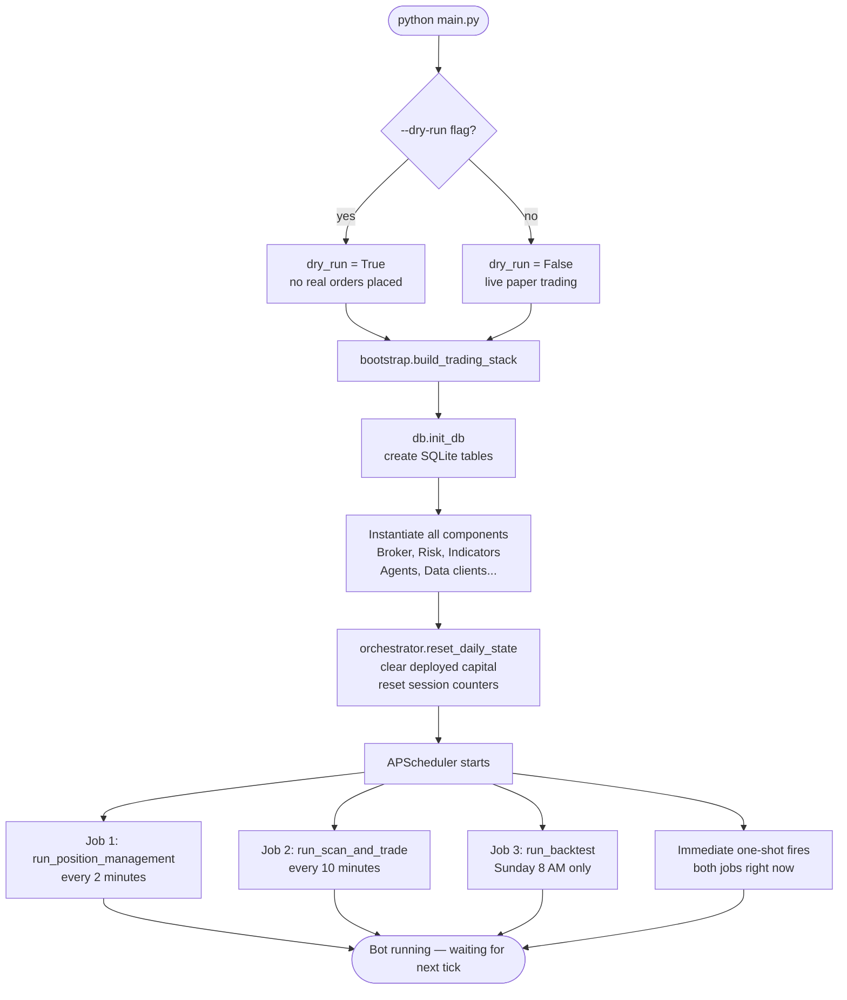
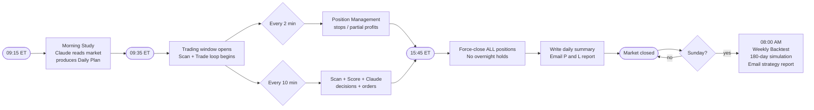
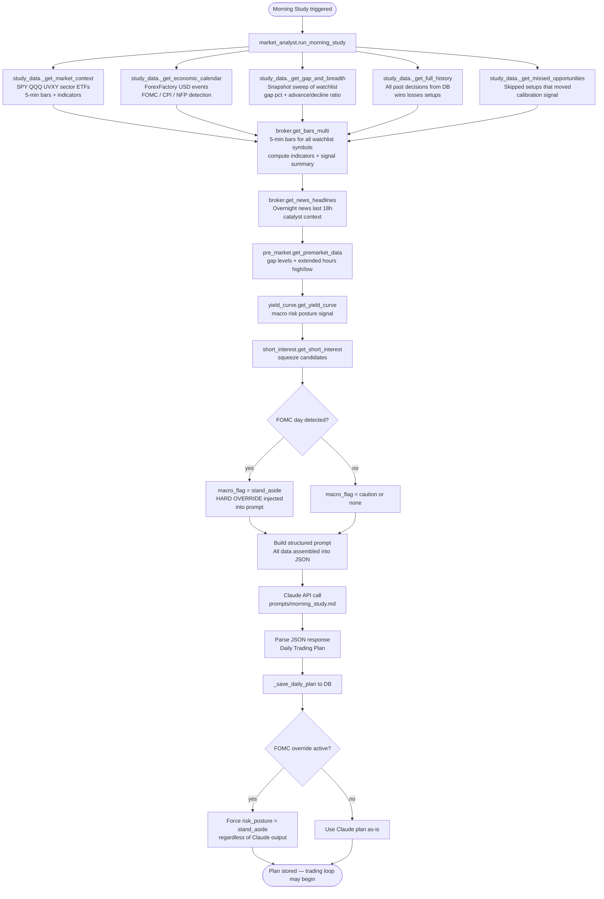
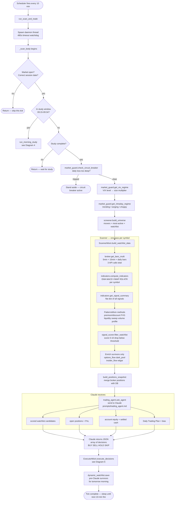
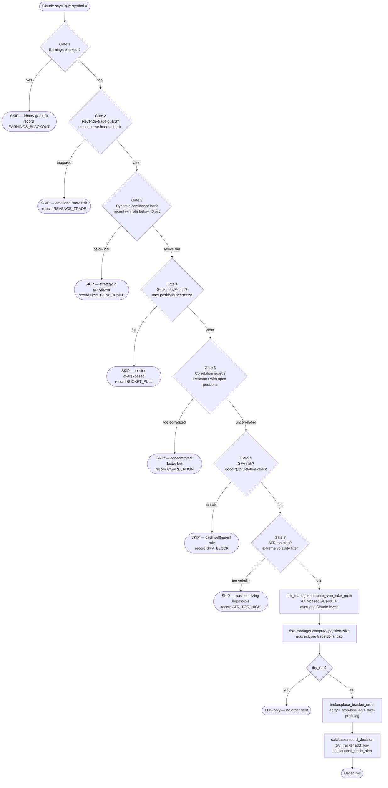
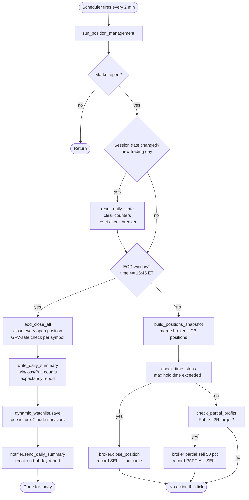
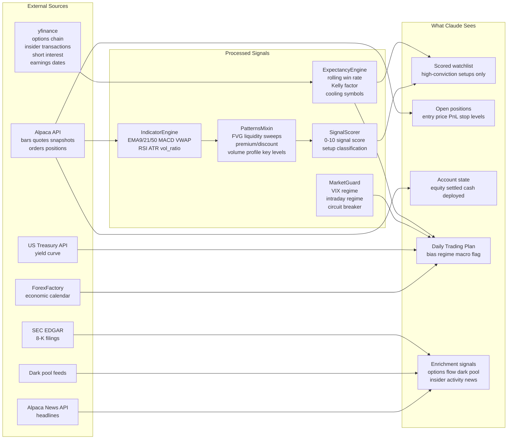
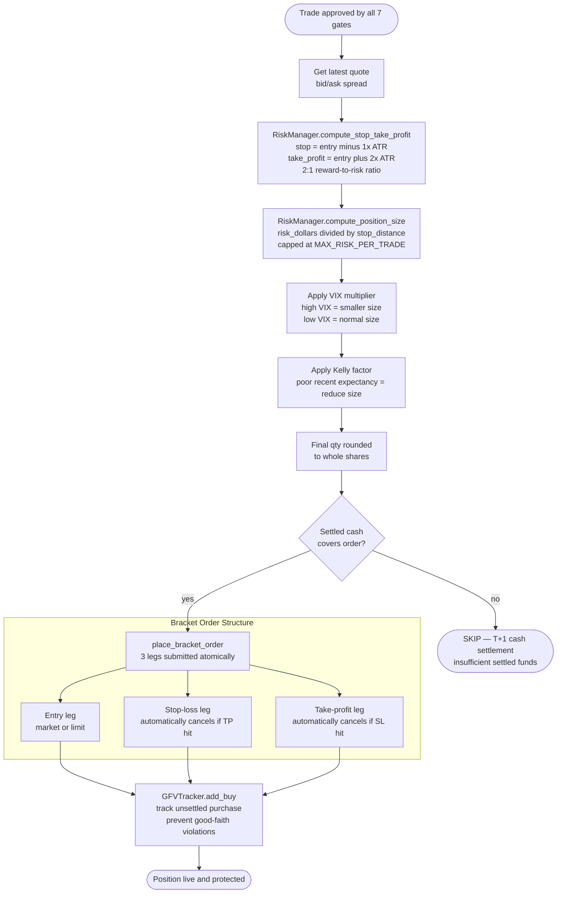

# Architecture

## 1. System Overview

High-level view of every package and how they connect.

```
┌─────────────────────────────────────────────────────────────────────┐
│                          main.py                                    │
│                    Entry point + Scheduler                          │
└────────────────────────┬────────────────────────────────────────────┘
                         │ builds via
                         ▼
┌─────────────────────────────────────────────────────────────────────┐
│                        bootstrap.py                                 │
│            Instantiates and wires all components                    │
└──┬──────────┬──────────┬──────────┬──────────┬──────────┬──────────┘
   │          │          │          │          │          │
   ▼          ▼          ▼          ▼          ▼          ▼
┌──────┐  ┌──────┐  ┌──────┐  ┌──────┐  ┌──────┐  ┌──────────┐
│core/ │  │data/ │  │risk/ │  │anal- │  │agent-│  │trading/  │
│      │  │      │  │      │  │ysis/ │  │s/    │  │          │
│Broker│  │7 ext.│  │Risk  │  │Indic-│  │Claude│  │Orchestr- │
│DB    │  │data  │  │GFV   │  │ators │  │Agent │  │ator      │
│      │  │clien-│  │Bucke-│  │Score-│  │Analy-│  │Scanner   │
│      │  │ts    │  │ts    │  │r     │  │st    │  │Executor  │
│      │  │      │  │Expec-│  │Guard │  │      │  │Positions │
│      │  │      │  │tancy │  │      │  │      │  │          │
└──────┘  └──────┘  └──────┘  └──────┘  └──────┘  └──────────┘
```

---

## 2. Startup Flow



---

## 3. Daily Schedule



---

## 4. Morning Study Flow (09:15–09:34 ET)

Runs once per day. Claude reads everything before a single trade is placed.



---

## 5. Ten-Minute Scan and Trade Cycle (09:35–15:44 ET)



---

## 6. Execution Gauntlet — 7 Gates Before Any Order

Every BUY decision from Claude must pass all seven checks. A single failure skips the trade and records the reason in the DB.



---

## 7. Two-Minute Position Management Loop

Fast path — no Claude involved, no market scanning.



---

## 8. Data Flow — What Feeds Claude



---

## 9. Risk Layer — How Positions Are Sized and Protected


