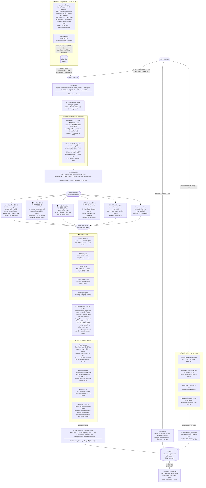

# System Architecture

```mermaid
flowchart TD
    SCHED(["⏰ APScheduler"])
    SCHED -->|"scan + trade · every 10 min\n9:35 AM – 3:45 PM ET"| CYCLE_START
    SCHED -->|"position monitor · every 2 min"| POSMGMT
    SCHED -->|"backtest · Sunday 8 AM"| BACKTEST

    %% ── MORNING STUDY ──────────────────────────────────────────
    subgraph MORNING ["📋 Morning Study  (8:30 – 9:35 AM ET)"]
        direction LR
        MS_IN["economic calendar · ForexFactory / FOMC\ngap scan + SPY/QQQ/sector breadth\npre-market levels · gap %, pm_high/low\nyield curve · 10Y-3M spread\nshort interest · squeeze risk\novernight news · Alpaca feed\nrecent trade history + missed opportunities"]
        ANALYST["MarketAnalyst\nClaude LLM\nprompts/morning_study.md"]
        MS_IN --> ANALYST
        ANALYST -->|"bias · posture · candidate list\nwarnings · confidence thresholds"| PLAN[("daily_plan\nSQLite")]
    end

    %% ── TRADE CYCLE ────────────────────────────────────────────
    CYCLE_START(["trade cycle start"])
    PLAN -->|"posture check\nstand_aside → skip\nconservative → reduce size"| CYCLE_START

    CYCLE_START --> SCREEN
    SCREEN["🔍 Screener\nAlpaca snapshots ranked by dollar_volume × |change%|\n+ most-actives  + gainers  + 75 fixed watchlist\n──────────────────────────────────────\n~150 symbol universe"]

    SCREEN --> SCAN
    SCAN["📊 ScannerMixin · fetch bars per symbol\n5 min · 15 min · 1 day  (up to 30 days back)"]

    SCAN --> IND
    subgraph IND ["📐 IndicatorEngine  (40 + indicators)"]
        direction LR
        IND_A["Trend: EMA 9 / 21 / 50, MACD crossovers\nMomentum: RSI 14, 10-bar momentum\nVolatility: ATR 14, vol_ratio (time-adjusted)\nIntraday: VWAP, gap %, ORB"]
        IND_B["Structural: FVG · liquidity sweeps · key S/R\nVolume profile: POC · VAH · VAL · LVN\nRelative strength vs SPY\nPremium/discount (Fib 50 %)\n15 min + daily higher-TF bias"]
    end

    IND --> SCORER
    SCORER["🎯 SignalScorer\nScore each symbol across 4 setup types:\ngap-and-go · VWAP-reclaim · mean-reversion · momentum\n──────────────────────────────────────────────────────\nKeep best score · filter score < 6.0 · sort desc"]

    SCORER --> ENRICH_FAN
    ENRICH_FAN(["top candidates\n(parallel enrichment)"])

    %% ── PARALLEL ENRICHMENT ────────────────────────────────────
    ENRICH_FAN --> OPT & DP & INS & SI & PMD & NEWS

    OPT["📈 OptionsFlowClient\nCBOE data via yfinance\nput/call ratio · call OI\nsignal: unusual_calls ·\nbullish_flow · bearish_flow\n(top 30 · 30 min cache)"]

    DP["🌑 DarkPoolClient\nFINRA REGSHO CNMSshvol\nshort_vol_pct per symbol\naccumulation ≥ 55 % (bullish)\ndistribution ≤ 35 % (bearish)\n(all syms · session cache)"]

    INS["🕵️ InsiderFlowClient\nSEC EDGAR Form 4\nopen-market buys\nbuyer · shares · value_usd\n(top 30 · 6 hr cache)"]

    SI["📉 ShortInterestClient\nFINRA / NASDAQ bi-monthly\n% float short · days-to-cover\nsignal: squeeze_risk · elevated\n(top 30 · 12 hr cache)"]

    PMD["🌅 PreMarketAnalyzer\nextended-hours bars 4 AM – 9:30 AM\ngap % · pm_high · pm_low · pm_vol\n(all syms · day cache)"]

    NEWS["📰 News Headlines\nAlpaca broker feed\n4-hour lookback\n(top 25 · 15 min cache)"]

    OPT & DP & INS & SI & PMD & NEWS --> MERGE
    MERGE(["merge enrichment\ninto watchlist items"])

    %% ── MARKET GUARDS ──────────────────────────────────────────
    MERGE --> GUARD
    subgraph GUARD ["🛡️ Market Guards"]
        direction LR
        G1["Circuit Breaker\nSPY ≤ −1.5 % from open\nOR  UVXY ≥ +5 %  → halt entries"]
        G2["VIX Regime\nrealized vol → size multiplier 0.4× – 1.1×"]
        G3["Yield Curve\n10Y-3M spread → size multiplier 0.85× – 1.0×"]
        G4["Earnings Blackout\nblock ± 2 calendar days around report"]
        G5["Intraday Regime\ntrending · ranging · choppy"]
    end

    GUARD --> AGENT

    %% ── AI DECISION ─────────────────────────────────────────
    AGENT["🤖 TradingAgent  (Claude LLM · prompts/trading_agent.md)\nInput: watchlist + open positions + account state\n       + recent decisions + daily_plan + bucket_report\nOutput JSON: symbol · action (BUY/SELL/SKIP)\n             entry · stop_loss · take_profit · qty\n             signal_confidence (1–10) · reward_to_risk · reason"]

    %% ── RISK & PORTFOLIO ────────────────────────────────────────
    AGENT --> RISK
    subgraph RISK ["⚖️ Risk & Portfolio Checks"]
        direction LR
        R1["RiskManager\ndrawdown cap · $200 / day\nexposure cap · 40 % of equity\nposition size · $200 – $1 000\nR:R ≥ 2.0 · confidence ≥ 6\nvol_ratio floor · spread ≤ 0.3 %"]
        R2["BucketManager\n1 position per sector bucket\n2nd position allowed if confidence ≥ 9\nsector rotation scoring via ETF strength"]
        R3["GFVTracker\nblock same-day resell\n(Good-Faith Violation · T+1 lock)"]
        R4["ExpectancyEngine\ncool symbols with win rate < 25 %\nsuppress setup type after 3 consecutive losses\ndynamic confidence bar after losing streak"]
    end

    RISK -->|"all checks pass"| EXEC

    %% ── EXECUTION ───────────────────────────────────────────────
    EXEC["✅ ExecutorMixin · position sizing\nbase size × ATR vol regime (0.35× – 1.0×)\n        × VIX regime  × yield curve\n        × Kelly criterion  × confidence scale\n────────────────────────────────────────\nbroker.place_market_order()  (Alpaca paper)"]

    EXEC --> DB[("SQLite\ndecisions · positions\ndaily_plans · daily_summary")]

    %% ── POSITION MANAGEMENT ─────────────────────────────────────
    subgraph POSMGMT ["⏱ PositionsMixin · every 2 min"]
        direction LR
        PM1["Time-stop: exit after 90 min\nif < 25 % of TP range reached"]
        PM2["Breakeven stop: move SL → entry + 1.0 %\nonce price reaches entry + 1.0 %"]
        PM3["Trailing stop: activate at +1.5 %\nthen trail back –1.2 %"]
        PM4["Partial profit: scale out 50 % of position\nat midpoint between entry and TP"]
    end

    POSMGMT -->|"stop triggered or TP hit"| CLOSE
    CLOSE["💰 broker.close_position()\nrecord_decision() · update P&L\nGFVTracker.remove_buy()"]
    CLOSE --> DB

    %% ── END OF DAY ──────────────────────────────────────────────
    DB -->|"end of day\n3:45 PM ET"| EOD
    EOD["📧 Notifier · daily email\nP&L · win rate · trade count\nexpectancy · top setup types\nsetup breakdown · alerts"]

    %% ── BACKTESTER ──────────────────────────────────────────────
    BACKTEST["🔬 Backtester\nMonte Carlo walk-forward on historical bars\nSharpe · max drawdown · win rate · P&L dist"]
    BACKTEST --> DB
```
